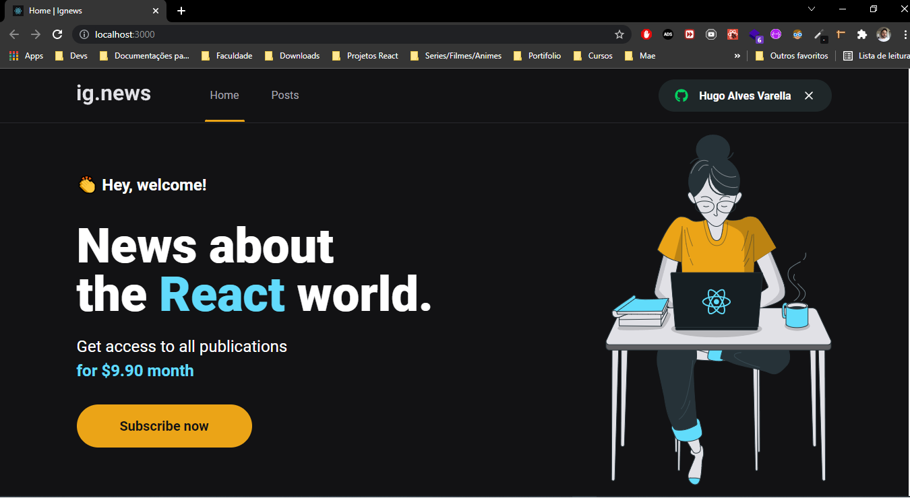
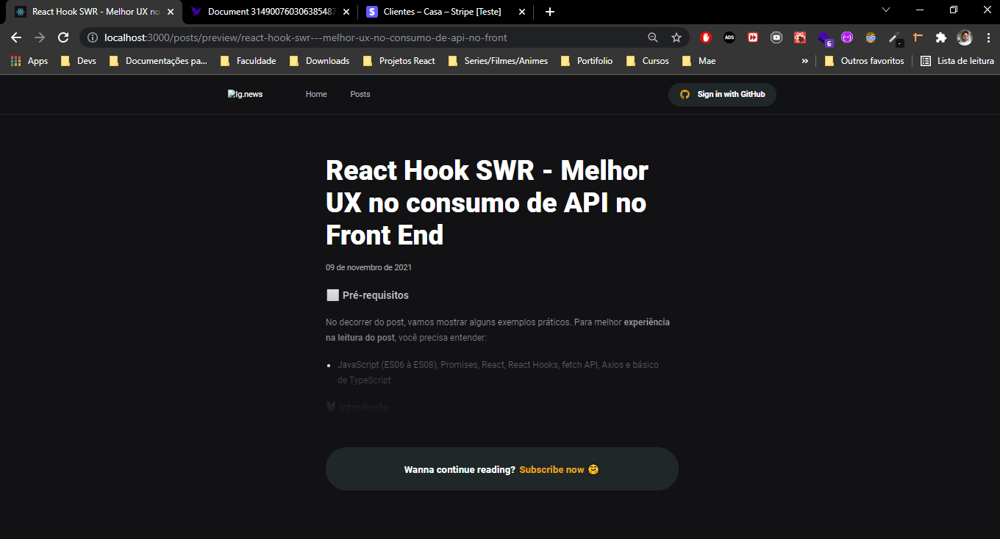
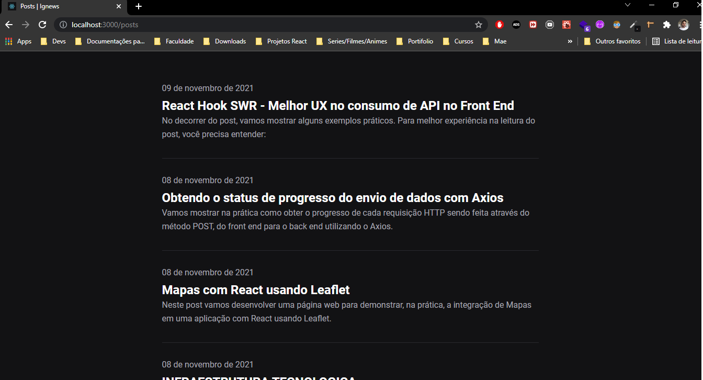
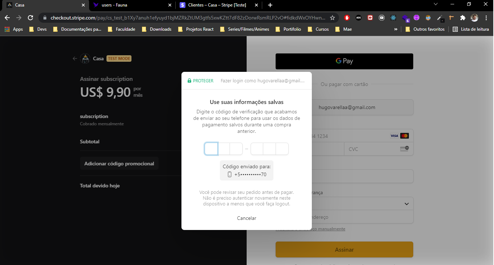
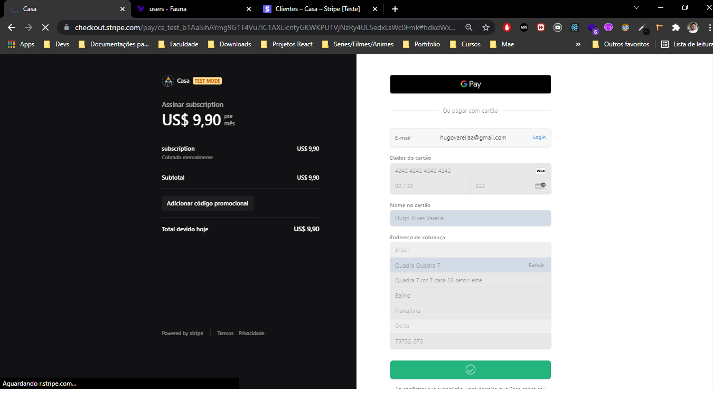
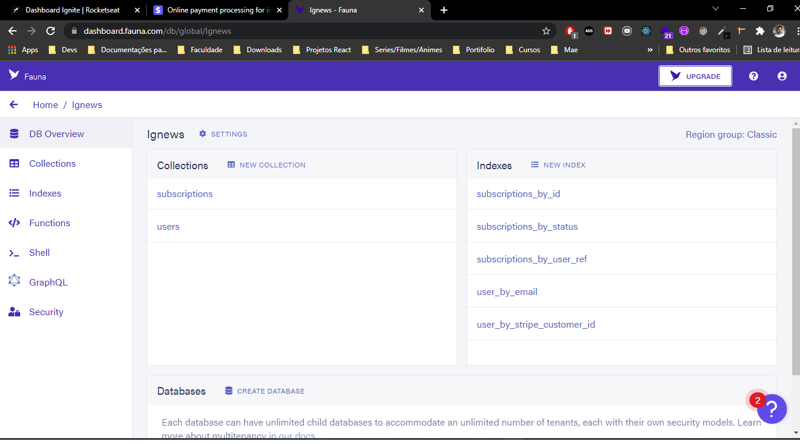
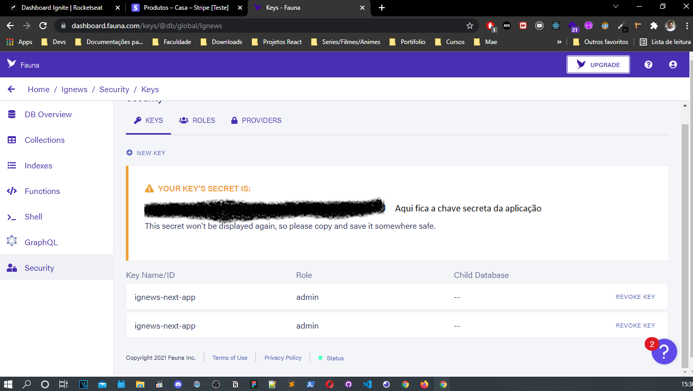
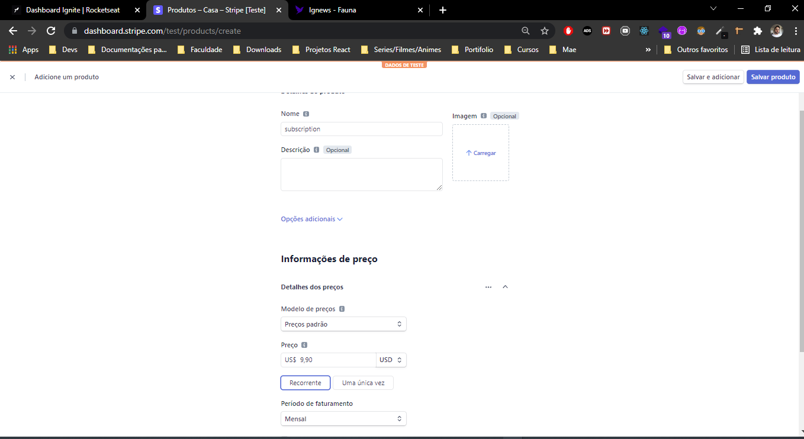
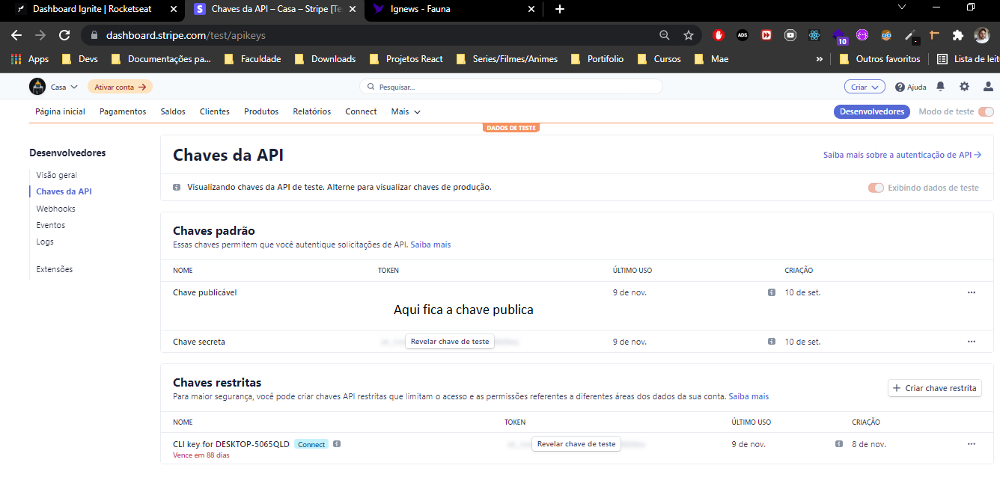

<h1 align="center">


</h1>

<p align="center">
  IGNEWS - Portal de notícias 📰🚀
  <br>
  <br>

## Sobre

O projeto ig.news é um blog onde os usuários podem ter acesso ao conteúdo de cada postagem de acordo com o status de sua assinatura.<br>
O blog possui um sistema de compra integrado com o STRIPE, e após o usuário realizar o pagamento, sua inscrição estará ativa e pronta para visualizar o conteúdo completo
de todo o blog. Caso o usuário não deseje optar pela assinatura, ele terá acesso limitado ao conteúdo das postagens. E todos os dados necessários para se fazer verificações
de assinaturas ou dados dos usuários, estão salvos no banco de dados FaunaDB.
<br>
<br>
Essa é uma aplicação Serverless, ou seja, todo o processo que dependeria de um backend foi integrado dentro do front e seguindo o padrão da JAMStack.
<br>
As postagens são feitas pelo painel do Prismic CMS e integradas diretamente pelo front.

<br>

---

## Rocket Tecnologias

As seguintes tecnologias foram utilizadas no projeto:

- [Next.js](https://nextjs.org/)
- [Prismic CMS](https://prismic.io/)
- [Stripe](https://stripe.com/)
- [FaunaDB](https://fauna.com/)

<br>
<br>

---

## Requerimentos

- [Node](https://nodejs.org/en/)
- [Yarn](https://yarnpkg.com/lang/en/)

---

## Como iniciar

```bash
# Clone this project
$ git clone https://github.com/Hugovarellaa/ignews

# Access
$ cd ignews

# Install dependencies
$ yarn

# Run the project
$ yarn dev

# The server will initialize in the <http://localhost:3000>
```

---

## Imagens

<h1 align="center">
    
    
    
    
    
</h1>

<br>

## FaunaDB

<p>
  - Deve ser criado 2 collections e 5 Indexes conforme as images abaixo
</p>
<h1 align="center">
    
    
</h1>

<br>

## Stripe

<br>

<p>
  - No stripe deve ser criado um produto conforme a image abaixo, que sera   acessado com as chaves.
</p>
<h1 align="center">
    
    
</h1>
